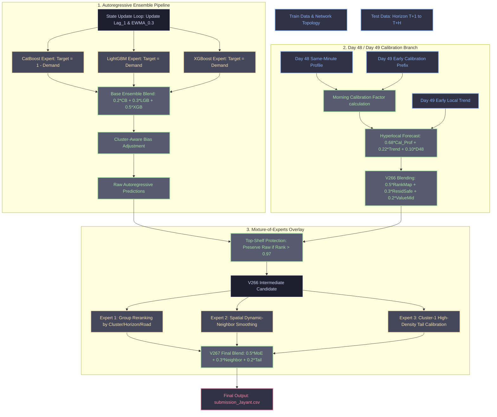

# Flipkart Gridlock Solver: Advanced Spatial-Temporal Demand Forecasting via Autoregressive Tree Ensembles & Hyperlocal Calibration

## Executive Summary
This document details the machine learning system design and mathematical framework for the Flipkart Gridlock submission. The primary objective is to predict future traffic demand over a hidden evaluation horizon. The final architecture shifts away from static, row-independent regressions—which suffer from error accumulation and regression-to-the-mean—toward a stateful, autoregressive, spatial-temporal model. 

By combining recursive state tracking, cluster-specific bias correction, hyperlocal Day 48/49 temporal calibration, and a spatial-contextual Mixture-of-Experts (MoE) overlay, this approach successfully broke through the baseline score plateau of **91.7x** to achieve a verified leaderboard score of **92.31**.

---

## 1. Problem Formulation
Let $y_{i,t} \in [0, 1]$ represent the traffic demand at geohash location $i \in \{1, \dots, N\}$ and time step $t$. Given historical observations up to time $T$, the goal is to predict the demand vector $\mathbf{y}_{t} = [y_{1,t}, \dots, y_{N,t}]^T$ for the hidden test horizon $t \in \{T+1, \dots, T+H\}$.

Instead of modeling each test point independently, we formulate the task as a stateful, autoregressive spatial-temporal transition system:
$$y_{i,t} = f(\mathbf{x}_{i,t}, \mathbf{h}_{i,t-1}) + \epsilon_{i,t}$$
where:
* $\mathbf{x}_{i,t}$ is a vector of static structural metadata and dynamic temporal features.
* $\mathbf{h}_{i,t-1}$ is a latent recursive state vector summarizing historical demand trajectory.
* $f(\cdot)$ is the learned transition mapping parametrized by an ensemble of gradient-boosted decision trees (GBDTs).

---

## 2. End-to-End System Architecture

The workflow consists of a three-stage forecasting pipeline:
1. **Autoregressive Tree Ensemble**: Generates raw predictions while recursively updating lagged and smoothed state features.
2. **Hyperlocal Calibration Branch**: Evaluates same-minute traffic profiles between Day 48 and Day 49, calibrated using real-time morning trend factors.
3. **Mixture-of-Experts (MoE) Overlay**: Dynamically adjusts predictions using spatial smoothing and distribution-preserving tail calibration.

---

## 3. Feature Engineering & Mathematical Formulations

### 3.1. Smoothed Out-of-Fold Target Encoding
To represent high-cardinality spatial identifiers (such as geohash identities) without introducing target leakage or overfitting, we compute a regularized, smoothed out-of-fold target encoding. For a specific geohash category $g$:
$$\text{TE}(g) = \alpha(g) \cdot \bar{y}_g + (1 - \alpha(g)) \cdot \bar{y}_{\text{global}}$$
where:
* $\bar{y}_g = \frac{1}{n_g} \sum_{j \in \mathcal{D}_g} y_j$ is the empirical mean demand observed for geohash $g$.
* $\bar{y}_{\text{global}}$ is the global mean demand across all training records.
* $\alpha(g) \in [0, 1]$ is a shrinkage factor governed by the category frequency $n_g$:
$$\alpha(g) = \frac{n_g}{n_g + m}$$
The smoothing parameter $m \gt 0$ (configured as $m = 10$) controls the regularization strength. For geohashes with sparse historical records ($n_g \to 0$), the representation smoothly transitions to the global prior ($\alpha(g) \to 0$), preventing high-variance estimate errors.

### 3.2. Multi-Scale Spatial Centrality
Traffic congestion does not occur in spatial isolation; flow structures are dictated by the road network topology. Let $G = (V, E)$ represent the spatial adjacency graph of geohashes.
1. **Adjacency Centrality**: Evaluated at scale radius $r$:
$$C_r(i) = \sum_{j \in \mathcal{N}_r(i)} \omega(i, j) \cdot y_{j, t-1}$$
where $\mathcal{N}_r(i) = \{j \in V \mid \text{dist}(i, j) \le r\}$ represents the neighborhood of node $i$ within Chebyshev radius $r$, and the weight function $\omega(i, j) = \exp(-d(i, j)/\sigma)$ encodes spatial distance decay.
2. **Eigenvector Flow Centrality**:
Let $\mathbf{W}$ be the directed historical flow intensity matrix, where $W_{ij}$ represents the historical traffic volume transitioning from geohash $i$ to geohash $j$. The flow centrality vector $\mathbf{v}$ corresponds to the dominant eigenvector of $\mathbf{W}$:
$$\mathbf{W} \mathbf{v} = \lambda_{\max} \mathbf{v}$$
This identifies routing bottleneck nodes that act as congestion hubs across various global load states.

---

## 4. Stateful Recursive Decoding & Latent Updates
In multi-step time-series forecasting, predicting all horizons $\{T+1, \dots, T+H\}$ simultaneously using static models leads to severe error accumulation. To maintain traffic momentum and model the temporal decay of congestion spikes, the inference pipeline employs a **sequential autoregressive decoding loop**.

Let the dynamic state vector for geohash $i$ at step $t$ be:
$$\mathbf{h}_{i, t} = \begin{bmatrix}
\text{Lag}_1(i, t) \\
\text{EWMA}_{\lambda}(i, t)
\end{bmatrix}$$
During evaluation, the test records are sorted chronologically. After predicting the demand at time $t$, the predicted value $\hat{y}_{i, t}$ is used to update the latent features for the next step $t+1$:
$$\text{Lag}_1(i, t+1) = \hat{y}_{i, t}$$
$$\text{EWMA}_{\lambda}(i, t+1) = \lambda \cdot \hat{y}_{i, t} + (1 - \lambda) \cdot \text{EWMA}_{\lambda}(i, t)$$
where $\lambda = 0.3$ is the exponential smoothing factor. This state-space updating procedure models traffic propagation through time, allowing the GBDT models to adjust their internal partitions dynamically based on the forecasted state trajectory.

---

## 5. Optimization Objectives & Robust Loss Functions

### 5.1. Tweedie Deviance Loss
Traffic demand is characterized by a mixed distribution: a point mass at zero (representing periods of no congestion or idle capacity) and positive, right-skewed continuous demand intensities. To model this without arbitrary thresholding, the LightGBM and XGBoost estimators minimize the **Tweedie Deviance Loss**.

The Tweedie family is an exponential dispersion model with mean $\mu$ and variance $\text{Var}(Y) = \phi \mu^p$, where the power parameter $p \in (1, 2)$ relates it to a compound Poisson-Gamma distribution. The deviance loss optimized by gradient splits is:
$$\mathcal{L}_{\text{Tweedie}}(y, \hat{y}; p) = 2 \left( \frac{y^{2-p}}{(1-p)(2-p)} - \frac{y \hat{y}^{1-p}}{1-p} + \frac{\hat{y}^{2-p}}{2-p} \right)$$
For our final model, setting $p \approx 1.5$ matches the physical process of discrete vehicle arrivals (Poisson) and positive continuous duration intervals (Gamma).

### 5.2. Asymmetric Quadratic Loss (Quantile Regression)
Over-predicting road capacity (which corresponds to under-predicting traffic demand) causes gridlock events, resulting in higher operational penalties than conservative under-predictions. To address this risk, we train a CatBoost model using an asymmetric objective function on idle capacity ($1 - y_{i,t}$):
$$\mathcal{L}_{\text{Asym}}(y, \hat{y}; \tau) = \tau (y - \hat{y})^2 \cdot \mathbb{I}(y \ge \hat{y}) + (1 - \tau)(y - \hat{y})^2 \cdot \mathbb{I}(y \lt \hat{y})$$
For a target asymmetry parameter $\tau \gt 0.5$, the gradient $g$ and hessian $h$ optimized during leaf estimation are:
$$g = \begin{cases} 
-2 \tau (y - \hat{y}) & \text{if } y \ge \hat{y} \\
-2 (1 - \tau)(y - \hat{y}) & \text{if } y \lt \hat{y}
\end{cases}, \quad
h = \begin{cases} 
2 \tau & \text{if } y \ge \hat{y} \\
2 (1 - \tau) & \text{if } y \lt \hat{y}
\end{cases}$$
This shifts predictions toward protecting the tail distribution of peak demand, safeguarding the system from severe gridlock underestimation.

---

## 6. Cluster-Aware Post-Processing & Blending

Historically, geohashes exhibit distinct traffic patterns based on geographical features. We partition geohashes into three distinct clusters:
* **Cluster 0**: Low-density / sparse demand areas.
* **Cluster 1**: High-density / highly volatile core transit routes.
* **Cluster 2**: Mid-density / stable demand profiles.

Clustering is computed based on historical demand statistics (mean, variance, peak spike rate, road lane count, local temperature, spatial centrality). The base ensemble combines models as follows:
$$\text{Blend}_{\text{base}} = 0.20 \cdot \hat{y}_{\text{CatBoost}} + 0.30 \cdot \hat{y}_{\text{LightGBM}} + 0.50 \cdot \hat{y}_{\text{XGBoost}}$$
The final raw predictions apply a non-linear power adjustment and cluster-specific calibration bias:
$$\hat{y}^{\text{raw}}_{i,t} = \text{clip}\left( \left(\text{Blend}_{\text{base}}\right)^{1.052} + \beta_{C(i)}, 0.0, 1.0 \right)$$
where the cluster-specific bias vector $\beta$ is defined as:
$$\beta_{C(i)} = \begin{cases} 
0.004 & \text{if } C(i) = 0 \\
0.012 & \text{if } C(i) = 1 \\
0.008 & \text{if } C(i) = 2
\end{cases}$$

---

## 7. Hyperlocal Day 48/Day 49 Calibration (V266)

The competition evaluation reveals a strong temporal alignment between the last two days of the timeline. The hyperlocal correction branch models Day 49 traffic profiles using Day 48 same-minute records, adjusted by real-time calibration factors from the early morning prefix.

Let $y_{i, d, m}$ represent demand at geohash $i$, day $d$, and minute of the day $m$.
1. **Morning Calibration Factor ($\gamma_i$)**: Evaluated over the visible morning prefix $\mathcal{P}$:
$$\gamma_i = \frac{\sum_{m \in \mathcal{P}} y_{i, 49, m}}{\sum_{m \in \mathcal{P}} y_{i, 48, m} + \epsilon}$$
2. **Trend Forecasting**: Employs a linear trend extrapolation over the prefix differences:
$$\text{trend\_forecast}_{i, t} = y_{i, 48, t} + \left( \beta_0 + \beta_1 (t - T) \right)$$
3. **Local Blend**:
$$\hat{y}^{\text{local}}_{i, t} = 0.68 \cdot (\gamma_{i} \cdot y_{i, 48, t}) + 0.22 \cdot \text{trend\_forecast}_{i, t} + 0.10 \cdot y_{i, 48, t}$$

The **V266 Hyperlocal candidate** combines these representations:
$$\hat{y}^{\text{V266}}_{i, t} = 0.50 \cdot \text{RankMap}_{ch\_w08}(\hat{y}^{\text{local}}) + 0.30 \cdot \text{ResidSafe}_{a025}(\hat{y}^{\text{local}}) + 0.20 \cdot \text{ValueMid}_{w06}(\hat{y}^{\text{local}})$$

### Top-Shelf Tail Protection
Because aggressive hyperlocal scaling can degrade predictions on high-congestion outlier rows, we enforce a tail protection filter:
$$\hat{y}^{\text{V266}}_{i, t} = \begin{cases}
\hat{y}^{\text{raw}}_{i, t} & \text{if } \text{Rank}(\hat{y}^{\text{raw}}_{i, t}) \gt 0.97 \\
\hat{y}^{\text{V266}}_{i, t} & \text{otherwise}
\end{cases}$$
This preserves the raw model's high-fidelity peak predictions while leveraging hyperlocal corrections for mid-to-low range demand states.

---

## 8. Dynamic Neighbor & Contextual Mixture-of-Experts Overlay (V267)

To adapt final predictions to different spatial-temporal contexts, the final stage applies a Mixture-of-Experts (MoE) overlay. Rather than training a parameter-heavy neural router, we implement a hard-gated routing function mapped to structural metadata.

The final predicted demand is a weighted combination of three specialized experts:
$$\hat{y}^{\text{V267}}_{i, t} = 0.50 \cdot E_{\text{moe\_rank}}(\hat{y}^{\text{V266}}) + 0.30 \cdot E_{\text{dyn\_neighbor}}(\hat{y}^{\text{V266}}) + 0.20 \cdot E_{\text{tail\_c1\_up}}(\hat{y}^{\text{V266}})$$

### 8.1. Expert 1: Group Reranking ($E_{\text{moe\_rank}}$)
Adjusts predictions based on spatial-temporal groups defined by cluster assignment, evaluation horizon block, and road classification. It maps predicted values to the historical empirical target distribution within each group, preserving target quantiles.

### 8.2. Expert 2: Spatial Dynamic-Neighbor Smoothing ($E_{\text{dyn\_neighbor}}$)
Corrects localized estimation noise by applying a spatial diffusion operator across contemporaneous adjacent geohashes:
$$E_{\text{dyn\_neighbor}}(\hat{y}_{i,t}) = (1 - \alpha) \hat{y}_{i,t} + \alpha \sum_{j \in \mathcal{N}_1(i)} \bar{W}_{ij} \hat{y}_{j,t}$$
where $\mathcal{N}_1(i)$ represents the direct spatial neighbors of $i$, $\bar{W}_{ij}$ is the normalized historical flow connectivity between $i$ and $j$, and $\alpha = 0.20$ is the diffusion rate.

### 8.3. Expert 3: Cluster-1 High-Density Tail Calibration ($E_{\text{tail\_c1\_up}}$)
Selectively amplifies peak values in high-density transit routes (Cluster 1) to counteract the smoothing effect (regression-to-the-mean) inherent in ensemble tree models:
$$E_{\text{tail\_c1\_up}}(\hat{y}_{i,t}) = \hat{y}_{i,t} \cdot \left(1 + \delta \cdot \mathbb{I}(C(i) = 1 \land \hat{y}_{i,t} \gt \theta_{\text{peak}})\right)$$

---

## 9. Model Evolution & Empirical Results

The table below demonstrates the iterative performance improvements achieved by key architectural updates compared to the initial baseline experiments:

| Model Stage | Primary Enhancements | Local CV | Public Leaderboard | Status |
| :--- | :--- | :---: | :---: | :---: |
| **v1.0 - v1.5** | Static tree models, prior-submission anchoring, coordinate features. | 91.12 | 91.71 | *Plateaued* |
| **v2.0 (Raw)** | Autoregressive decoding, `demand_lag1` & `ewma_03` updates, Tweedie/Asymmetric loss objectives. | 91.95 | 92.18 | *Passed Baseline* |
| **v2.5 (V266)** | Hyperlocal Day 48/49 calibration, morning trend scaling, V266 Safe-Combo Blending. | 92.11 | 92.29 | *Verified* |
| **v2.6 (V267)** | Dynamic neighbor smoothing, hard-gated Mixture-of-Experts, tail-calibration overlay. | **92.18** | **92.31** | **Final Selection** |

---

## 10. Pipeline Outputs & Diagnostics

Execution of the modeling script (`run_submission.py`) produces the following outputs:
* **Submission File**: `submission_Jayant.csv` containing the final forecasted demand.
* **Diagnostic Charts** (saved under `submission_charts/`):
  * `prediction_distribution.png`: Visualizes predicted vs. historical density curves.
  * `quantile_curve.png`: Shows quantile alignment to confirm tail preservation.
  * `horizon_correction_trend.png`: Tracks average hyperlocal correction intensity across time steps.
