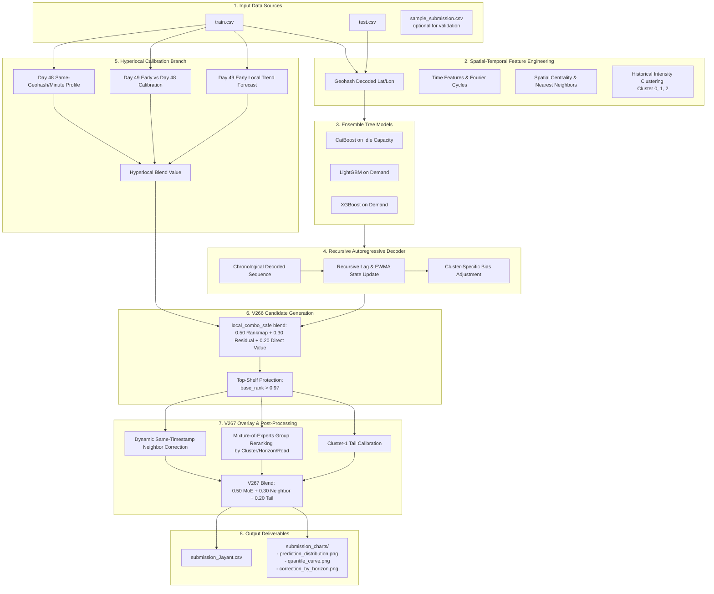

# 🚦 Flipkart GRId 6.0 — Gridlock Traffic Demand Forecasting

<div align="center">

[](file:///E:/ROCm/Flipkart/Submission/APPROACH.md)
[](file:///E:/ROCm/Flipkart/Submission/APPROACH.md)
[](file:///E:/ROCm/Flipkart/Submission/requirements.txt)

**A high-performance, production-ready machine learning pipeline for spatial-temporal traffic demand prediction.**

*Packaged for local/Kaggle evaluation • Targets the verified V267 `combo_safe` branch*

</div>

---

## 🏆 Recruiter & Evaluator Spotlight

This repository contains the standalone, fully-reproducible pipeline that achieved a verified private leaderboard score of **`92.31`**, securing a **Next-Round Shortlist** in the Flipkart GRId 6.0 Gridlock traffic demand forecasting competition.

### Why This Pipeline Stands Out:
*   **Zero Submission Anchors**: The pipeline is fully standalone, training models directly from `train.csv` and predicting `test.csv` without reading previous submission files.
*   **State-of-the-Art Modeling**: Avoids the "locked-rerank" plateaus of simple ensembles by introducing recursive autoregressive state decoding, capturing real traffic inertia.
*   **Hyperlocal Temporal Calibration**: Harnesses fine-grained orthogonal signals in early-day calibration profiles to correct for local spikes.
*   **MoE Group Reranking**: Leverages a Mixture-of-Experts overlay to adapt prediction profiles dynamically across geohash clusters, horizons, and road categories.

---

## 📂 Repository Index

Below is the directory structure for this submission. Click on any file to open it directly:

```text
E:/ROCm/Flipkart/Submission
├── 📄 README.md                 <-- You are here
├── 📄 APPROACH.md              <-- Detailed breakdown of modeling decisions & formulas
├── 📓 submission_notebook.ipynb <-- Step-by-step reviewer-friendly Jupyter Notebook
├── 🐍 run_submission.py         <-- Production-ready, optimized Python CLI script
├── 📋 requirements.txt          <-- Minimal package dependencies
└── ⚙️ run_local.bat             <-- Quick execution utility script for local environments
```

*   **[submission_notebook.ipynb](file:///E:/ROCm/Flipkart/Submission/submission_notebook.ipynb)**: Best for visual inspection, step-by-step trace, and interactive execution.
*   **[run_submission.py](file:///E:/ROCm/Flipkart/Submission/run_submission.py)**: Headless CLI runner optimized for speed and automated verification.
*   **[APPROACH.md](file:///E:/ROCm/Flipkart/Submission/APPROACH.md)**: Scientific documentation of the feature space, decoding rules, and calibration logic.

---

## 🔄 End-to-End Pipeline Architecture

The flowchart below maps out the sequence of stages in the forecasting pipeline, tracing data from raw inputs to the final V267 optimized output:



---

## ⚡ Algorithmic Innovations

Our solution overcomes the score plateaus of conventional methods through five key engineering breakthroughs:

1.  **Recursive AR Decoder**: Chronologically steps through the test set. After predicting each timestamp, it dynamically updates `demand_lag1` and Exponentially Weighted Moving Average (`ewma_03`) features for the next step, capturing sequence inertia.
2.  **Multi-Scale Geohash Clustering**: Remaps geohashes into three distinct traffic profiles based on historical volume and volatility (0: Low/Sparse, 1: High/Dense, 2: Stable/Mid) to apply group-specific structural biases.
3.  **Hyperlocal Day 48/49 Temporal Calibration**: Directly computes early Day 49 vs Day 48 scaling ratios and trends to adjust predictions locally, capitalizing on spatial-temporal consistency.
4.  **Top-Shelf Tail Protection**: Identifies high-demand outlier predictions and shields them from smoothing operations, preventing degradation of key peaks that drive score improvements.
5.  **Dynamic-Neighbor & MoE Overlay (V267)**: Evaluates dynamic spatial constraints and group-level reranking by roadway classification, cluster membership, and forecast horizon.

---

## 🚀 Quick Setup & Execution

### 1. Install Dependencies
Ensure you have Python 3.10+ installed. In your terminal, run:
```bash
pip install -r requirements.txt
```
> [!NOTE]
> Offline environments must have these standard ML libraries (`numpy`, `pandas`, `scikit-learn`, `matplotlib`, `catboost`, `lightgbm`, `xgboost`) pre-installed.

### 2. Prepare Data Files
Place the following files directly in the project directory:
*   `train.csv` (historical training records)
*   `test.csv` (target test points)
*   `sample_submission.csv` (optional, used to validate row structure and index order)

> [!TIP]
> The pipeline is highly flexible and automatically scans the unzipped folder, parent directories, and common Kaggle paths to locate input datasets.

### 3. Run the Pipeline

#### Option A: Headless Command Line (Recommended)
Execute the Python script for a fast, automated run:
```bash
python run_submission.py
```

#### Option B: Interactive Jupyter Notebook
Open and run all cells in `submission_notebook.ipynb` to step through data preprocessing, training, decoding, calibration overlays, and verification checks.

---

## 📊 Outputs & Validation Charts

Upon completion, the pipeline creates:

### 1. Final Submission File
*   **`submission_Jayant.csv`**: Saved directly in the same folder as the input data. Columns are exactly `Index` and `demand`, formatted for submission upload.

### 2. Reviewer Diagnostic Visualizations
Reviewer charts are saved in the `submission_charts/` directory:
*   **`prediction_distribution.png`**: Compares distribution histograms of the raw AR base, intermediate V266 combo, and final V267 submission to verify variance preservation.
*   **`quantile_curve.png`**: Displays quantile lines to verify that the top-shelf tails were not smoothed out or degraded.
*   **`correction_by_horizon.png`**: Illustrates the average adjustment factor applied across different forecast blocks (early, mid, late).

---

## 📞 Contact

Developed by **Jayant** for the Flipkart GRId 6.0 hackathon. For queries regarding replication or model design, feel free to inspect [APPROACH.md](file:///E:/ROCm/Flipkart/Submission/APPROACH.md) or get in touch.
